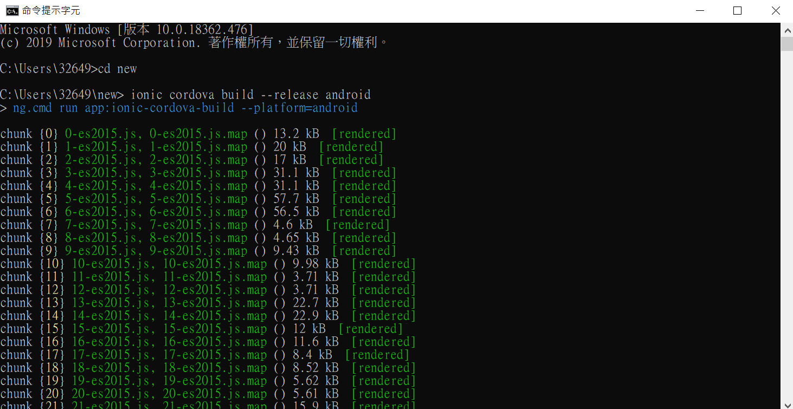
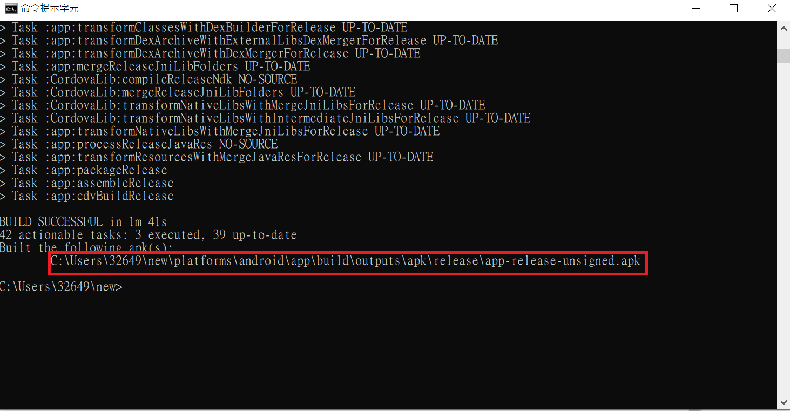

# ionic 環境
> 下載 Ionic

參考資料: [Ionic Environment Setup](https://ionicframework.com/docs/installation/environment)

以下說明為windows版本，在cmd中輸入以下指令

* install the ionic CLI and Cordova

      npm install -g ionic cordova
    
    
> code editor

一般的 code editor 都可以用來編譯 ionic 的程式碼，在官網上提供了兩款他們推薦的編譯器

在這裡，我們是使用 VS Code 來編譯我們的程式

* [Ionic Studion](https://ionicframework.com/studio?utm_source=docs&utm_medium=website&utm_campaign=studio%20launch)
* [VS Code](https://code.visualstudio.com/)

> Node.js

現代JavaScript項目的工具都基於 Node.js ，可以直接連接這個 [download](https://nodejs.org/en/download/)

> Git

看個人需求來決定是覅安裝 Git ，在這裡我們是沒有安裝，如果有需要的話可以看官網的[教學](https://ionicframework.com/docs/installation/environment)

# 開始ionic專案
**( 小提醒 : 新專案的檔案位置和輸入cmd的資料夾是在同一個地方 )**
> start an app

*name* 是你這個專案的名稱\
*template* 是你個專案的版型，ionic有3種基本的版型 *blank*、*sidemenu*、*tabs*

    ionic start [<name>] [<template>]

在 LazyQ+ 中，我們是使用 *sidemenu* 這個版型作為基礎來修改

> run your APP

ionic 會在你的瀏覽器上顯示你現在這份APP的樣子

    cd [<name>]
    ionic serve

\
參考資料 : [Jonny Huang 的學習筆記](https://jonny-huang.github.io/ionic/training/01_creating_first_project/)

# 匯出 APK
從 cmd 進入自己的專案後，輸入以下指令打包成 apk 檔

       ionic cordova build --release android

下圖為輸入時，cmd在跑的樣子

在跑完之後，下面紅色框框的部分為apk檔儲存的地方喔~

參考資料: [Publishing your app](https://ionicframework.com/docs/v1/guide/publishing.html)

\
下一篇 : [編寫 LOGIN 頁面](2_編寫login頁面.md)

