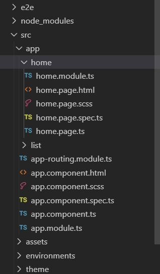
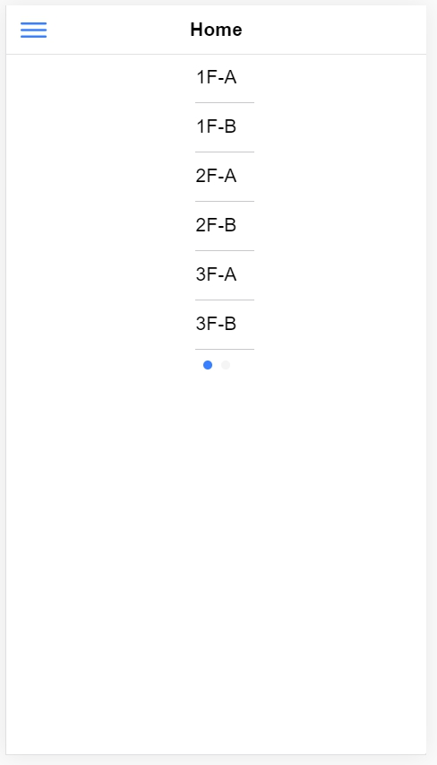
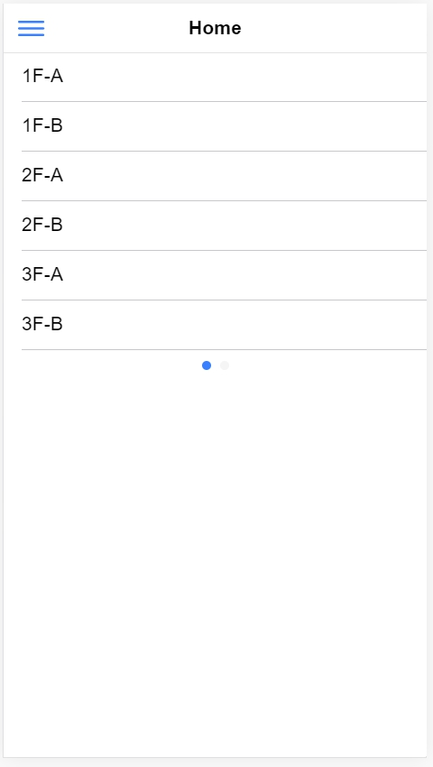
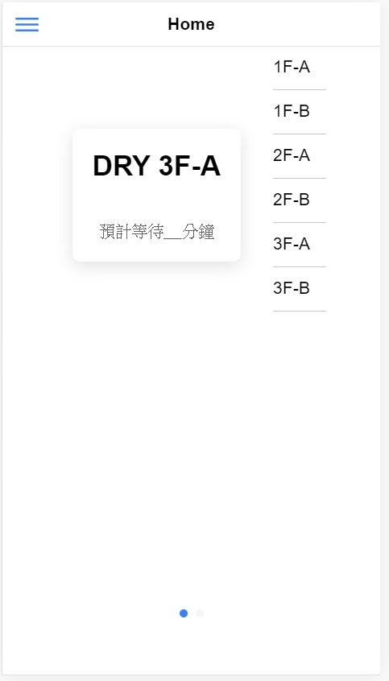
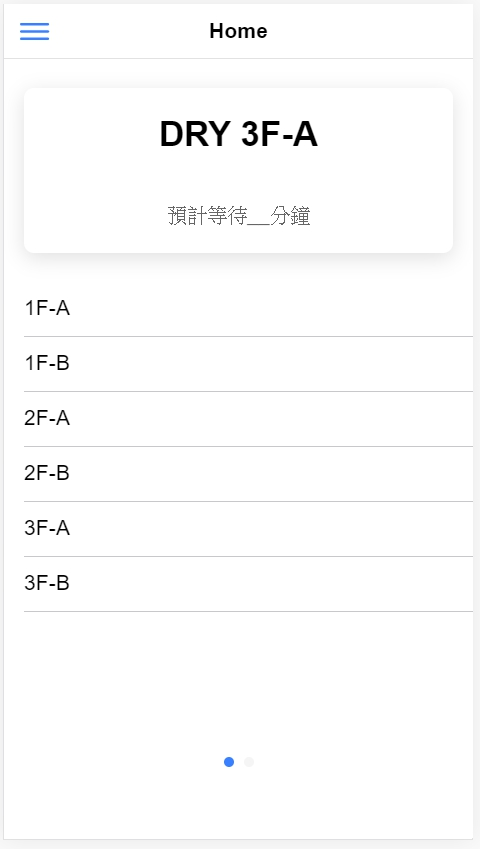
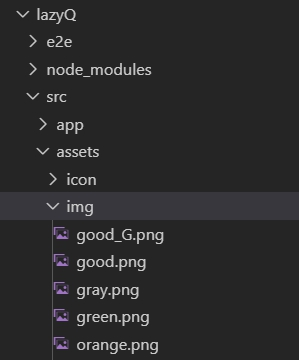
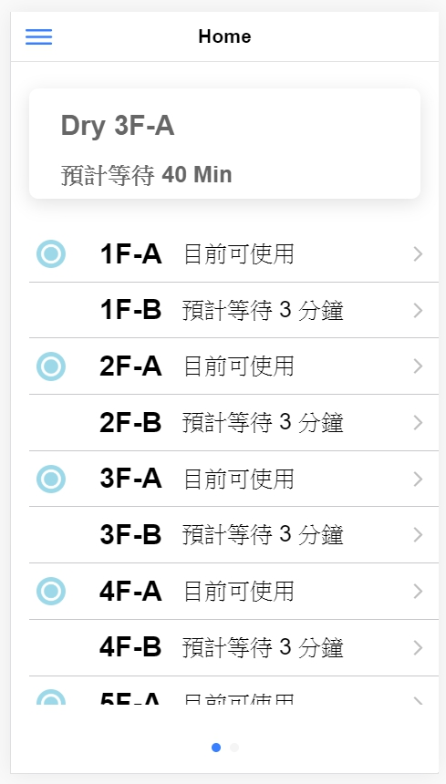
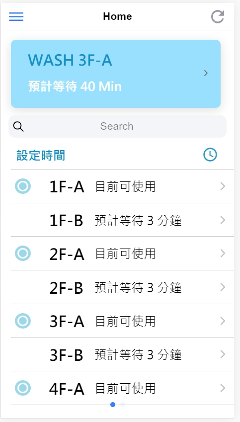
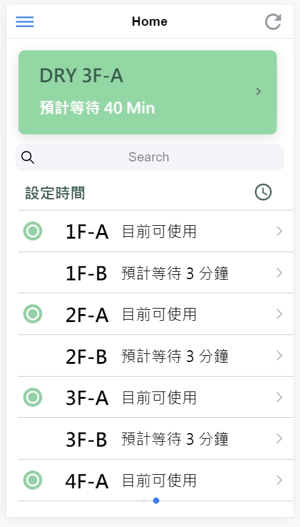

## 如何開始 coding ?

在這裡我們使用 [VS code](https://code.visualstudio.com/) 來做編寫程式

在cmd中輸入

    code .

就會將整個檔案資料夾匯入 VS code 中

## 本篇重點
- [Slide](#slide)
- [List & Item](#List_Item)
- [Card](#Card)
- [加入 Image](#Image)
- [用戶輸入資訊 Input](#Input)

# Home Page

我們可以在 **src/app/home/** 中找到 home.page.html 、 home.page.scss ...

在 home.page.html 中，我們的 coding 方式就跟一般我們寫 html 一樣

而在 home.page.scss 中，編寫的方式也是跟平常我們寫網頁的 css 一樣

那我們為什麼要選擇使用 ionic 呢??

**ionic** 不同的地方是，他有自己的一些[UI Components](https://ionicframework.com/docs/components)可以使用

藉由這些UI元件，我們可以快速的完成許多功能

> <h3 id="slide">Slide</h3>

在這裡因為我們頁面的需求，我們需要一個可以左右滑動的頁面

在 ionic UI Components 中有個功能是 [ion-slides](https://ionicframework.com/docs/api/slides) 可以實現我們的需要

    <ion-slides pager="true">
        <ion-slide>
          <h1>Slide 1</h1>
        </ion-slide>

        <ion-slide>
          <h1>Slide 2</h1>
        </ion-slide>
    </ion-slides>

我們只要這份 code 放到我們需要的地方，便可以直接使用

ionic UI Components 有個好處，每個 UI 都可以設定各種屬性和功能，來更加符合自己的需求

\
**Properties** : 可以設定各種 ionic 定義的屬性，可以直接加在 **< >** 中

Ex. 在 ion-slides 中加入 pager 屬性
    
    <ion-slides pager="true">

\
**Events** : 可以設定各種 ionic 定義的觸發事件，連動.ts 的 function ，也是可以直接加在 **< >** 中

Ex.  在 ion-slides 中加入 ionSlideDidChange Events

     <ion-slides (ionSlideDidChange)="funtion()">

----------------------------------------------------- 

> <h3 id="List_Item">List & Item</h3>

在這裡我們使用 [ion-list](https://ionicframework.com/docs/api/list) 和 [ion-item](https://ionicframework.com/docs/api/item) 來幫助我們列出每一台機台資訊

    <ion-list>
        <ion-item>
            <ion-label>1F-A</ion-label>
        </ion-item>
        <ion-item>
            <ion-label>1F-B</ion-label>
        </ion-item>
        <ion-item>
            <ion-label>2F-A</ion-label>
        </ion-item>
        <ion-item>
            <ion-label>2F-B</ion-label>
        </ion-item>
        <ion-item>
            <ion-label>3F-A</ion-label>
        </ion-item>
        <ion-item>
            <ion-label>3F-B</ion-label>
        </ion-item>
    </ion-list>

在完成以上教學，我們可以得到一個這樣的介面

因為我們的 **slide** 介面沒有幫它設定寬度，所以就會擠成一塊

這個時候，我們可以來編寫 CSS 讓我們的版面更好看

\
我們可以在 **ion-list** 中加入 *style* 來加入我們 CSS code

     <ion-list style="width: 100%;">

或是我們也可以在 **html.page.scss** 中加入

    .list_style{
        width: 100%;
    }

然後再在 **html.page.html** 的 **ion-list** 中加入 *class*

    <ion-list class="list_style">

這樣我們就可以得到以下這個結果 ↓ ↓ ↓

\
在這裡，我們 **ion-list** 的長度是隨著它所包的內容物而增長

如果我們幫它設定了 *height* 便可以固定它的高度

但這樣就會造成，如果我們的 ion-list 所包括的東西高度大於了我們所設定的 *height* ，超過的部分就會直接被隱藏起來

那我們要怎麼處理這個問題呢??? 

其實很簡單，我們只要加一行 CSS code 便可以解決這個煩惱

    overflow-y: scroll;

這行 code 會讓超過的部分，可以已向下滾動的方式呈現，這樣我們的資料就不會不見啦~~ 

\
*overflow* 還有一些其他的功能，我們在這裡就不細細講解了，有興趣的話可以參考以下這份連結

[CSS overflow 屬性用法](https://www.wibibi.com/info.php?tid=157)

-----------------------------------------------------

> <h3 id="Card">Card</h3>

再來我們要來使用 ionic UI components 中的 [**ion-card**](https://ionicframework.com/docs/api/card)
 
    <ion-card>
      <ion-card-header>
      <ion-card-title>DRY 3F-A</ion-card-title>
      </ion-card-header>
      <ion-card-content>預計等待__分鐘</ion-card-content>
    </ion-card>

它看起來跟上面的寫法差不多，只要把它加入 home.page.html 看起來就好了

但是你會發現，怎麼它出來的結果跟我們預想的不一樣呢????

\
我們該如何調整它，才能讓它不要擠在一起呢??? 

在這裡，我們想到的解決方式是使用 *div* 

我們分別使用兩個 *div* 來把我們之前寫的 list 和要加上的 card 包起來

再把 *class* 的部分移到合適的位置
    
    

        <ion-card>
              <ion-card-header>
                  <ion-card-title>DRY 3F-A</ion-card-title>
              </ion-card-header>
              <ion-card-content>預計等待__分鐘</ion-card-content>
        </ion-card>
        

            <ion-list>
                <ion-item>
                    <ion-label>1F-A</ion-label>
                </ion-item>
                <ion-item>
                    <ion-label>1F-B</ion-label>
                </ion-item>
                <ion-item>
                    <ion-label>2F-A</ion-label>
                </ion-item>
                <ion-item>
                    <ion-label>2F-B</ion-label>
                </ion-item>
                <ion-item>
                    <ion-label>3F-A</ion-label>
                </ion-item>
                <ion-item>
                    <ion-label>3F-B</ion-label>
                </ion-item>
            </ion-list>
        

    

    
      
這樣他們就可以和平的待在一塊了

在 *card* 中，我們不一定要使用既有的 **ion-card-header** 和 **ion-card-content**

我們也可以使用原本 *html* 中就有的 **h1** 、 **p** ...等，來編譯我們的 card 內容

---------------------------------------------------------------------

> <h3 id="Image">加入 Image</h3>

在 LazyQ+ 中，我們想要讓使用者更一覽無遺的找到哪一台機台是空閒的

所以我們便在 *item* 裡面插入我們製作的圖片，來體醒使用者

ionic 要加入圖片跟 html 的寫法一樣
         
    
    
但是我們的圖片檔案該放在哪裡，ionic 才能抓得到呢???

在這裡，我們在 src\assets\ 中建立一個資料夾 *img* ，在裡面我們放入我們需要用到的圖片檔案

並在 *img* *src* 中加上圖片檔案位置來連結這張圖片
     
    

這樣我們就可以得到以下的結果 ↓ ↓ ↓

\
在 ionic 中 [ion-icon](https://ionicons.com/) 這個 UI 提供了我們許多常見的的圖示，只要在需要圖示的地方輸入

    <ion-icon name="add-circle-outline"></ion-icon>
    
就可以直接使用這些圖示，而且只要你更改 *name* 值，就可以直接更換圖示，超級方便的~ 

之後我們要連動到 *firebase* 的時候，我們會再來調整 home.page 裡面的 code
 
> <h3 id="Input">Input</h3>

現在我們需要一個能讓使用者**輸入時間**來觀看機台各個時間點狀況的方法

ionic 中 [ion-input](https://ionicframework.com/docs/api/input) 這個 UI 提供我們一個快速抓取使用者輸入值的功能

但是，我們現在要抓取的數值是時間，時間有許多的輸入格式

如果我們要求使用者依照我們要的格式輸入，而使用者卻輸入了另一種格式，這樣可能造成我們的程式出錯

為了避免以上問題，我們在這裡選擇使用 ionic 中另一個更方便的 UI 

[ion-datetime](https://ionicframework.com/docs/api/datetime) 提供使用者以滾動的方式選取時間數值

     <ion-datetime displayFormat="HH : mm" class="word_4" style="color:#148FC4"></ion-datetime>

我們可以在 **ion-datetime** *Properties* 中的 displayFormat 規定我們需要的資料格式

也可以使用 *Event* 來抓取使用者的輸入資訊，以供我們之後在寫 .ts 的時候使用

# home.page.html & home.page.scss 整合

在之前幾篇講解的功能整合，並加上 CSS 的修改後，我們可以得到以下的成果

\
在文字的方面，我們使用了 CSS 的 *font-family* 來把我們 APP 中的字改成我們想要的字型

    font-family:Microsoft JhengHei;

並用 *text-align* 來達到文字靠左的效果

    text-align: left;

機台列表的部分

我們使用了 **ion-label** 在 item 中加入文字

因為 **ion-label** 不會換行，而且會平均分配空間給每個 **label**，所以我們只要用 CSS 的 *margin* 功能就可以達到上圖的效果

    <ion-label>  </ion-label>
    
    margin-left: 7%;

在 item ，我們使用了它的 *Properties* 中的 **detail** ，它會讓最 item 的最後面增加一個 **">"** 的符號 

這個小東西可以提示使用者在使用 APP 時，更容易發現那裡可以點進去，這跟我們未來要設計的功能有所相關

另外，別忘了我們的 **slider** 還有另一個喔，另一頁的寫法跟這頁有 87% 相似

至於為什麼我們會使用 **slider** 來製作另一個頁面，而不是再開啟一個新的 page 的原因

等到我們連動 *firebase* 之後，我們會再跟大家解釋

\
色彩配色的部分，在這裡提供大家一些我們這次有用到的一些小工具: 

[色碼表_1](https://www.toodoo.com/db/color.html) : 這個網頁提供了很多常用顏色的色碼表

[色碼表_2](https://www.ifreesite.com/color/) : 這個網頁提供了許多顏色由淺到深的色碼，在最下方也可以自己調色

[colorspire.com](https://www.colorspire.com/) : 這個網頁可以讓大家嘗試各種顏色搭配的效果

[paletton.com](http://paletton.com/#uid=33r0u0kgQXl3M+MbaZnlEU2qbNW) : 這個網站也提供了各種方式，讓我們能嘗試不同的配色方式

\
那麼，基本的 **home.page.html** 和 **home.page.scss** 的coding就到這裡啦~ \
我們把另一頁做完的話會長這樣子 ↓ ↓ ↓

