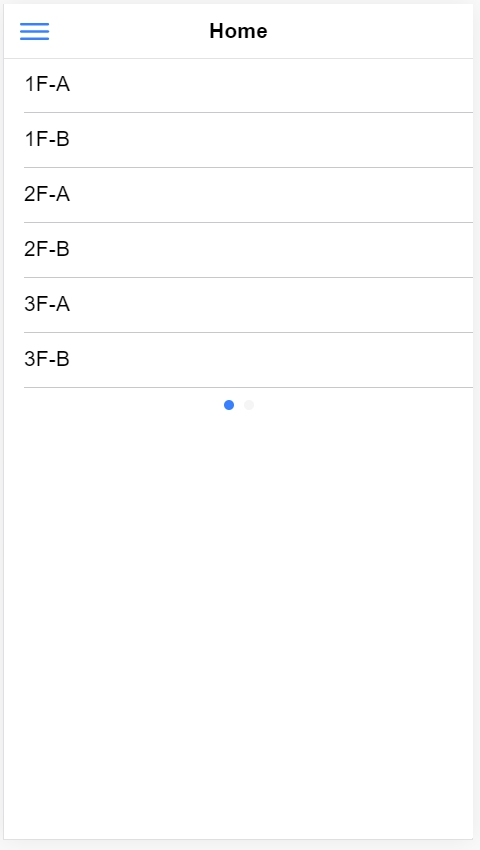

## 如何開始 coding ?

在這裡我們使用 [VS code](https://code.visualstudio.com/) 來做編寫程式\
在cmd中輸入

    code .

就會將整個檔案資料夾匯入 VS code 中

## Home Page

我們可以在 **src/app/home/** 中找到 home.page.html 、 home.page.scss ...

在 home.page.html 中，我們的 coding 方式就跟一般我們寫 html 一樣\
而在 home.page.scss 中，編寫的方式也是跟平常我們寫網頁的 css 一樣\
\
那我們為什麼要選擇使用 ionic 呢??\
**ionic** 不同的地方是，他有自己的一些[UI Components](https://ionicframework.com/docs/components)可以使用\
藉由這些UI元件，我們可以快速的完成許多功能

> **Slide**

在這裡因為我們頁面的需求，我們需要一個可以左右滑動的頁面\
在 ionic UI Components 中有個功能是 [ion-slides](https://ionicframework.com/docs/api/slides) 可以實現我們的需要

    <ion-slides pager="true">
        <ion-slide>
          <h1>Slide 1</h1>
        </ion-slide>

        <ion-slide>
          <h1>Slide 2</h1>
        </ion-slide>
    </ion-slides>

我們只要這份 code 放到我們需要的地方，便可以直接使用\
\
ionic UI Components 有個好處，每個 UI 都可以設定各種屬性和功能，來更加符合自己的需求\
\
**Properties** : 可以設定各種 ionic 定義的屬性，可以直接加在 **< >** 中\
Ex. 在 ion-slides 中加入 pager 屬性
    
    <ion-slides pager="true">

\
**Events** : 可以設定各種 ionic 定義的觸發事件，連動.ts 的 function ，也是可以直接加在 **< >** 中\
Ex.  在 ion-slides 中加入 ionSlideDidChange Events

     <ion-slides (ionSlideDidChange)="funtion()">

 

> **List & Item**

在這裡我們使用 [ion-list](https://ionicframework.com/docs/api/list) 和 [ion-item](https://ionicframework.com/docs/api/item) 來幫助我們列出每一台機台資訊

    <ion-list>
        <ion-item>
            <ion-label>1F-A</ion-label>
        </ion-item>
        <ion-item>
            <ion-label>1F-B</ion-label>
        </ion-item>
        <ion-item>
            <ion-label>2F-A</ion-label>
        </ion-item>
        <ion-item>
            <ion-label>2F-B</ion-label>
        </ion-item>
        <ion-item>
            <ion-label>3F-A</ion-label>
        </ion-item>
        <ion-item>
            <ion-label>3F-B</ion-label>
        </ion-item>
    </ion-list>

在完成以上教學，我們可以得到一個這樣的介面

因為我們的 **slide** 介面沒有幫它設定寬度，所以就會擠成一塊\
這個時候，我們可以來編寫 CSS 讓我們的版面更好看\
\
我們可以在 **ion-list** 中加入 *style* 來加入我們 CSS code

     <ion-list style="width: 100%;">

\
或是我們也可以在 **html.page.scss** 中加入

    .list_style{
        width: 100%;
    }

然後再在 **html.page.html** 的 **ion-list** 中加入 *class*

    <ion-list class="list_style">

這樣我們就可以得到以下這個結果 ↓ ↓ ↓

\
在這裡，我們 **ion-list** 的長度是隨著它所包的內容物而增長\
如果我們幫它設定了 *height* 便可以固定它的高度\
但這樣就會造成，如果我們的 list 所包括的東西高度大於了我們所設定的 *height* ，超過的部分就會直接被隱藏起來\
那我們要怎麼處理這個問題呢???
\
其實很簡單，我們只要加一行 CSS code 便可以解決著個煩惱

    overflow-y: scroll;

這行 code 會讓超過的部分，可以已向下滾動的方式呈現，這樣我們的資料就不會不見啦~~ \
*overflow* 還有一些其他的功能，我們在這裡就不細細講解了，有興趣的話可以參考以下這份連結\
[CSS overflow 屬性用法](https://www.wibibi.com/info.php?tid=157)

