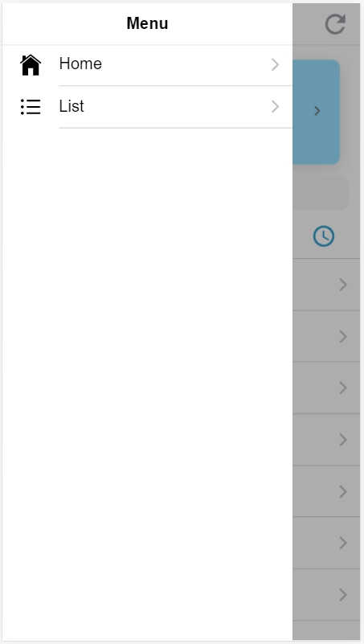
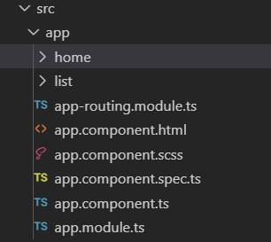
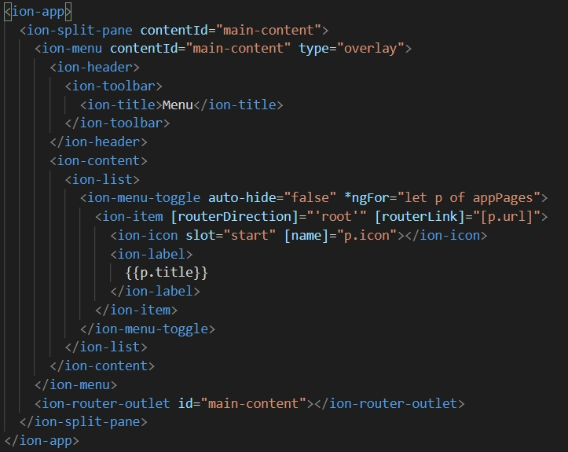
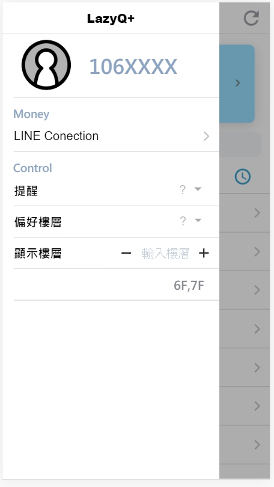

## Menu Page

在做完 Home Page 之後，我們要來開始編寫我們的 Menu ，在最初我們選擇模板的時候，我們是使用 *sidemenu* 

我們可以 **往右滑動** 或是 **點擊左上方圖示** 來開啟我們的 Menu 

一開始的 Menu 會長這樣 ↓ ↓ ↓ 



Ionic 已經幫我們設定好兩個連結

一個是我們編譯過的 HomePage，另一個是 Ionic 幫你開好的新頁面 ListPage，但是我們這裡還不會用到這個頁面 

那我們要更該這個 Menu 要從哪裡更動呢 ? ? ? 

\
他的code不在 HomePage ，也不在 ListPage ， 在 **src/app/app.component.html** 中



開啟他的 code 會看到這樣 ↓ ↓ ↓



這份 code 看起來很像一般的 HTML ，但是你會發現裡面多了很多不是 HTML 的東西 

像是 : 

> ***ngFor="let p of appPages"** 

這是 Angular for 迴圈的寫法，他會把這個 **<> </>**  中間的 code 依照需求重複，讓我們不用重複打很多一樣的 code 

至於詳細他要怎麼用，我們未來用的時候再來詳談它 : ) 

\
我們把不必要的 code刪除後，我們可以看到 Menu 會變成空白的

我們在 Menu 想要增加「用戶資訊」、「用戶設定」、「LINE連接的功能」

在我們經過 coding 之後，它們變成這樣的頁面 ↓ ↓ ↓



在這裡我們用到的功能在之前的教學中幾乎都有提到過，除了 *select* 這個功能之外

> **Select**

[ion-select](https://ionicframework.com/docs/api/select) 這個功能提供我們方便設定選擇的資料，也方便我們抓取用戶選擇的資訊 
```html   
    <ion-select placeholder="?" style="margin-left: 65%;" interface="action-sheet">
      <ion-select-option value="Y">Yes</ion-select-option>
      <ion-select-option value="N">No</ion-select-option>
    </ion-select>
```
每一組 **ion-select** 可以有多個的 *ion-select-option* 

每個 *ion-select-option* 都有自己的 value 值，用在之後回傳用戶選擇的資訊，可以依照自己的需求設定需要的 value 值 

**interface** 在這裡提供了不同跳出選項的方式，像是 : *alert* 、 *popover* 、*action-sheet* 

這些跳出選項的方式都可以在 [ion-select](https://ionicframework.com/docs/api/select) 這個網站旁邊的範例試玩


\
下一篇 : [連結 Firebase](5_連接Firebase.md)


