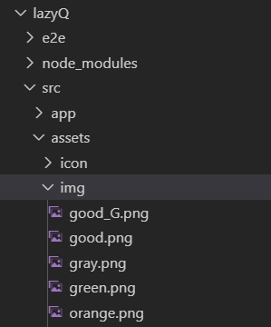
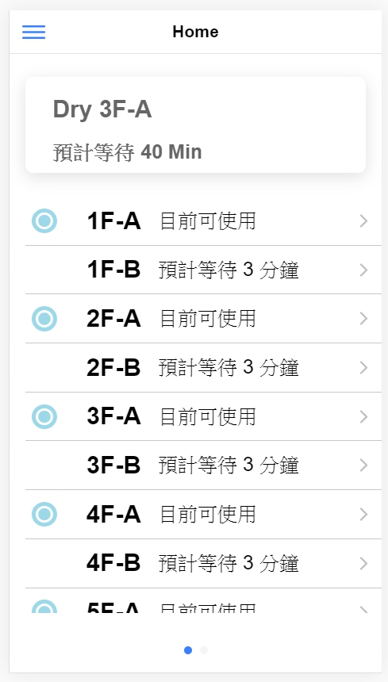

## Home Page

繼上一篇，我們繼續幫我們的 home.page.html 增加點東西

> **Card**

今天我們要來使用 ionic UI components 中的 [**ion-card**](https://ionicframework.com/docs/api/card)
 
    <ion-card>
      <ion-card-header>
      <ion-card-title>DRY 3F-A</ion-card-title>
      </ion-card-header>
      <ion-card-content>預計等待__分鐘</ion-card-content>
    </ion-card>

\
它看起來跟上一篇一樣的簡單，只要把它加入 home.page.html 看起來就好了\
但是你會發現，怎麼它出來的結果跟我們預想的不一樣呢????

\
我們該如何調整它，才能讓它不要擠在一起呢??? \
\
在這裡，我們想到的解決方式是使用 *div* \
我們分別使用兩個 *div* 來把我們之前寫的 list 和要加上的 card 包起來\
再把 *class* 的部分移到合適的位置
    
    

        <ion-card>
              <ion-card-header>
                  <ion-card-title>DRY 3F-A</ion-card-title>
              </ion-card-header>
              <ion-card-content>預計等待__分鐘</ion-card-content>
        </ion-card>
        

            <ion-list>
                <ion-item>
                    <ion-label>1F-A</ion-label>
                </ion-item>
                <ion-item>
                    <ion-label>1F-B</ion-label>
                </ion-item>
                <ion-item>
                    <ion-label>2F-A</ion-label>
                </ion-item>
                <ion-item>
                    <ion-label>2F-B</ion-label>
                </ion-item>
                <ion-item>
                    <ion-label>3F-A</ion-label>
                </ion-item>
                <ion-item>
                    <ion-label>3F-B</ion-label>
                </ion-item>
            </ion-list>
        

    

    
      
這樣他們就可以和平的待在一塊了

在 *card* 中，我們不一定要使用既有的 **ion-card-header** 和 **ion-card-content**
\
我們也可以使用原本 *html* 中就有的 **h1** 、 **p** ...等，來編譯我們的 card 內容  

> **加入 Image**

在 LazyQ+ 中，我們想要讓使用者更一覽無遺的找到哪一台機台是空閒的\
所以我們便在 *item* 裡面插入我們製作的圖片，來體醒使用者\
\
ionic 要加入圖片跟 html 的寫法一樣
         
    
    
但是我們的圖片檔案該放在哪裡，ionic 才能抓得到呢???\
在這裡，我們在 src\assets\ 中建立一個資料夾 *img* ，在裡面我們放入我們需要用到的圖片檔案

並在 *img* *src* 中加上圖片檔案位置來連結這張圖片
     
    

這樣我們就可以得到以下的結果 ↓ ↓ ↓

\
在 ionic 中 [ion-icon](https://ionicons.com/) 這個 UI 提供了我們許多常見的的圖示，只要在需要圖示的地方輸入

    <ion-icon name="add-circle-outline"></ion-icon>
    
就可以直接使用這些圖示，而且只要你更改 *name* 值，就可以直接更換圖示，超級方便的~ 

> **Input**

[ion-input](https://ionicframework.com/docs/api/input) 這個 UI 提供我們一個方便的功能，讓我們可以快速的抓取到使用者的輸入值\
\
[ion-datetime](https://ionicframework.com/docs/api/datetime) 跟 *ion-input* 很相似，這個 UI 提供我們一個能讓使用者快速選擇 **時間** **日期** 的操作介面\
讓我們不用要求使用者用 *ion-input* 輸入特定格式的日期時間\
\
在這裡我們使用 *ion-dateime* 來讓使用者輸入先觀看機台的時間點

