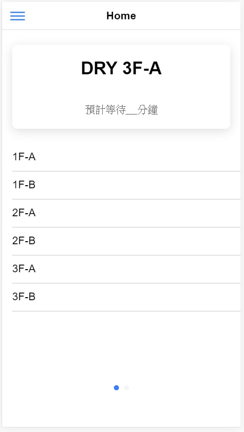

## Home Page

繼上一篇，我們繼續幫我們的 home.page.html 增加點東西

> **Card**

今天我們要來使用 ionic UI components 中的 [**ion-card**](https://ionicframework.com/docs/api/card)
 
    <ion-card>
      <ion-card-header>
      <ion-card-title>DRY 3F-A</ion-card-title>
      </ion-card-header>
      <ion-card-content>預計等待__分鐘</ion-card-content>
    </ion-card>

\
它看起來跟上一篇一樣的簡單，只要把它加入 home.page.html 看起來就好了\
但是你會發現，怎麼它出來的結果跟我們預想的不一樣呢????

\
我們該如何調整它，才能讓它不要擠在一起呢??? \
\
在這裡，我們想到的解決方式是使用 *div* 
我們分別使用兩個 *div* 來把我們之前寫的 list 和要加上的 card 包起來
    
    

        <ion-card>
              <ion-card-header>
                  <ion-card-title>DRY 3F-A</ion-card-title>
              </ion-card-header>
              <ion-card-content>預計等待__分鐘</ion-card-content>
        </ion-card>
        

            <ion-list>
                <ion-item>
                    <ion-label>1F-A</ion-label>
                </ion-item>
                <ion-item>
                    <ion-label>1F-B</ion-label>
                </ion-item>
                <ion-item>
                    <ion-label>2F-A</ion-label>
                </ion-item>
                <ion-item>
                    <ion-label>2F-B</ion-label>
                </ion-item>
                <ion-item>
                    <ion-label>3F-A</ion-label>
                </ion-item>
                <ion-item>
                    <ion-label>3F-B</ion-label>
                </ion-item>
            </ion-list>
        

    

    
      
這樣他們就可以和平的待在一塊了

在 *card* 中，我們不一定要使用既有的 **ion-card-header** 和 **ion-card-content**
\
我們也可以使用原本 *html* 中就有的 **h1** 、 **p** ...等，來編譯我們的 card 內容  \

> **Input**

