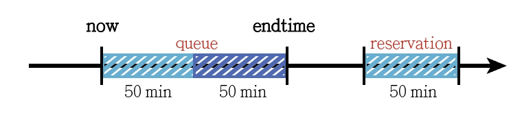
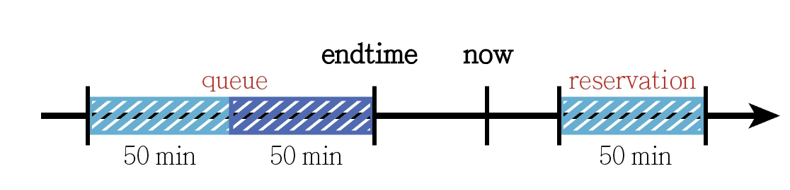

# 連結 Firebase 機台資料

處理好我們的 Firebase 後，我們開始來連結我們的資料到 APP 中 \
\
在這裡我們要來連結我們 APP 上顯示機台資訊的資料\
我們在 **Firebase** 中，資料處存的形式是這樣

機台資料的處理上，我們需要抓取到 **Firebase collection** 中每一個 *doc* \
我們可以使用 for迴圈 來抓取我們所需要的資料

    for (let i = 1; i < 10; i++) {
        var b=""
        var docRef = this.afstore.collection("washer").doc(b + i);
        docRef.get().subscribe(function (doc) {
            //處理資料的地方
        })
    }

*在 javascript 中，結尾的 " ; " 可有可無* \
\
在 **docRef.get().subscribe(function (doc){}** 中，我們可以抓取到firebace的各個資料\
但是我們無法把裡面的資料 *push* 到位面的 array 中，那這樣我們該如何將我們的資料放到我們 APP 中呢 ? ? \
\
解決方法是，我們在 **.html** 檔中，把我們想要放資料的位子的 <></> 中，設置一個 **id** \
並用 js 抓取這個 ID ，來改變 <></> 中的東西

    document.getElementById("wf" + floor).innerHTML = ""

知道該怎麼寫後，我們開始來處理我們的資料吧 ~ \
我們想要顯示的資訊有很多，但是不能把介面搞得過於複雜，這樣對於使用者會造成許多的不便利

> **首先，我們先來思考一下我們想要給使用者得到的資訊有哪些 ? ? ?**
1. 一開始現在的時間點，每一台機台的使用狀態
2. 在使用者更動時間點後，我們需要顯示的機台使用狀態
3. 可預約的時間僅限今日 6.am ~ 隔日 2.am，
4. 每台機器在每次的預約時段中，只能被預約 **3** 次

>**機台的使用形況有三種:**
* 目前可以使用
* 正在被使用，排隊中
* 目前沒有被使用，但是未來50分鐘內機台已經被預約了 

這些情況都會需要用到我們的時間資訊，來計算某個時間點上，我們機台的使用情況

>資料表示:\
*endtime* 表示了我們機台目前的使用結束時間\
*floor* 表示機台所在位置\
*order* 表示已越約人數\
*schedule* 表示已排隊跟預約的資料，資料型態為 **"20:30 106XXXX"** ，前面表示排隊\預約的時間，後面表示使用者的ID

有了這些資料後，我們還缺少一個 data，那就是現在的時間\
要抓取現在時間很簡單，只需要使用 **Date()** 就可以得知我們現在的時間了

    var nowtime = new Date()    //Tue Nov 26 2019 20:25:10 GMT+0800

有了各種資料後，讓我們來開始計算時間吧 ! !\
在這裡我們使用的是 24 小時制，這樣會讓我們的計算方便很多\
\
在這裡我們需要思考一下，因為我們的時間 range 不是 今天12.am ~ 隔天12.am，而是 今天6.am ~ 隔天2.am \
這樣會出現假如有一個時間點在 12.pm 之前，一個在 12.pm 之後的狀況\
解決方法有兩種:
* 寫一堆的 if else
* 把 12.pm 之後 時間點直接加 24

在這裡我們選用後者，雖然把它直接加上 24hr 看起來數字不太符合 24小時制，但是我們之後會扣掉，這並不會影響結果\
再來我們需要判斷每個時間點會需要怎樣的判斷\
\
如果要判斷 endtime 跟現在的時間差，如果現在時間 nowtime 減去 endtime 的差**大於 0**，表示這台機器正在被使用\
這樣我們會顯示說 **" 需要等待??分鐘 "**

如果要判斷 endtime 跟現在的時間差，如果現在時間 nowtime 減去 endtime 的差**小於 0**，表示這台機器現在沒有被使用\
這樣我們就要繼續判斷 **schedule** 中，未來 50 分鐘內是否有被預約 ?\
如果沒有就可以顯示 **" 可以使用 "**\
不行的話就顯示 **" 已被預約 "**

在思考完運算流程後，就是各位大大的 coding time 啦 ~ ~ \
\
使用者切換時間後讀取資料的方法跟一開始讀進來的方法有 87% 像\
不一樣的 13% 在於我們要抓取 **< ion-datetime >** 的時間資料，因此，我們需要幫它加上一個參數方便我們取值

    [(ngModel)]="WashDate"
    [(ngModel)]="DryDate"
    
除了加上上述的參數外，我們需要在 **home.page.ts** 中把參數設為 Global variable

    WashDate: any;
    DryDate: any;

*any 表示任何型態*

剩下的寫法就跟之前講的一樣了，大家加油 coding 囉 !

