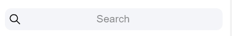

## Home Page

在這一篇，我們來把我們基本的 home.page 完成\
之後我們要連動到 *firebase* 的時候，我們會再來調整 home.page 裡面的 code
 
> **Input**

現在我們需要一個能讓使用者**輸入時間**來觀看機台各個時間點狀況的方法\
\
ionic 中 [ion-input](https://ionicframework.com/docs/api/input) 這個 UI 提供我們一個快速抓取使用者輸入值的功能\
\
但是，我們現在要抓取的數值是時間，時間有許多的輸入格式\
如果我們要求使用者依照我們要的格式輸入，而使用者卻輸入了另一種格式，這樣可能造成我們的程式出錯\
\
為了避免以上問題，我們在這裡選擇使用 ionic 中另一個更方便的 UI \
\
[ion-datetime](https://ionicframework.com/docs/api/datetime) 提供使用者以滾動的方式選取時間數值

     <ion-datetime displayFormat="HH : mm" class="word_4" style="color:#148FC4"></ion-datetime>

我們可以在 **ion-datetime** *Properties* 中的 displayFormat 規定我們需要的資料格式\
也可以使用 *Event* 來抓取使用者的輸入資訊，以供我們之後在寫 .ts 的時候使用

> **Sarch**

為了可以方便使用者快速的搜尋自己想要的機台，我們使用了 [ion-searchbar](https://ionicframework.com/docs/api/searchbar) 來提供用戶搜索功能\

但是在 ionic 中， **ion-searchbar** 只提供輸入搜索字串的這個功能，而後面該如何搜索? 搜索什麼?? \
這就要看大家背後 .ts 怎麼去編寫了， ionic 只提供一個框架給你

## home.page.html & home.page.scss 整合

在之前幾篇講解的功能整合，並加上 CSS 的修改後，我們可以得到以下的成果

\
在文字的方面，我們使用了 CSS 的 *font-family* 來把我們 APP 中的字改成我們想要的字型

    font-family:Microsoft JhengHei;

並用 *text-align* 來達到文字靠左的效果

    text-align: left;

機台列表的部分\
我們使用了 **ion-label** 在 item 中加入文字\
因為 **ion-label** 不會換行，而且會平均分配空間給每個 **label**，所以我們只要用 CSS 的 *margin* 功能就可以達到上圖的效果

    <ion-label>  </ion-label>
    
    margin-left: 7%;

在 item ，我們使用了它的 *Properties* 中的 **detail** ，它會讓最 item 的最後面增加一個 **">"** 的符號 \
這個小東西可以提示使用者在使用 APP 時，更容易發現那裡可以點進去，這跟我們未來要設計的功能有所相關\
\
另外，別忘了我們的 **slider** 還有另一個喔，另一頁的寫法跟這頁有 87% 相似\
\
至於為什麼我們會使用 **slider** 來製作另一個頁面，而不是再開啟一個新的 page 的原因\
等到我們連動 *firebase* 之後，我們會再跟大家解釋\
\
色彩配色的部分，在這裡提供大家一些我們這次有用到的一些小工具: \
[色碼表_1](https://www.toodoo.com/db/color.html) : 這個網頁提供了很多常用顏色的色碼表\
[色碼表_2](https://www.ifreesite.com/color/) : 這個網頁提供了許多顏色由淺到深的色碼，在最下方也可以自己調色\
[colorspire.com](https://www.colorspire.com/) : 這個網頁可以讓大家嘗試各種顏色搭配的效果\
[paletton.com](http://paletton.com/#uid=33r0u0kgQXl3M+MbaZnlEU2qbNW) : 這個網站也提供了各種方式，讓我們能嘗試不同的配色方式\
\
那麼，基本的 **home.page.html** 和 **home.page.scss** 的coding就到這裡啦~ \
我們把另一頁做完的話會長這樣子 ↓ ↓ ↓

