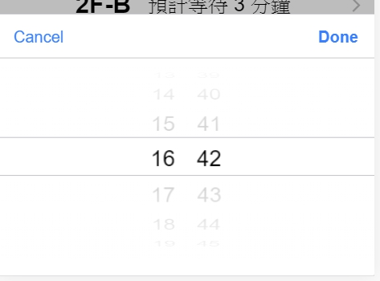

## Home Page

在這一篇，我們來把我們基本的 home.page 完成\
之後我們要連動到 *firebase* 的時候，我們會再來調動裡面的內容
 
> **Input**

現在我們需要一個能讓使用者**輸入時間**來觀看機台各個時間點狀況的方法\
\
ionic 中 [ion-input](https://ionicframework.com/docs/api/input) 這個 UI 提供我們一個快速抓取使用者輸入值的功能\
\
但是，我們現在要抓取的數值是時間，時間有許多的輸入格式\
如果我們要求使用者依照我們要的格式輸入，而使用者卻輸入了另一種格式，這樣可能造成我們的程式出錯\
\
為了避免以上問題，我們在這裡選擇使用 ionic 中另一個更方便的 UI \
\
[ion-datetime](https://ionicframework.com/docs/api/datetime) 提供使用以滾動的方式選取時間數值

我們可以在 **ion-datetime** *Properties* 中規定我們需要的資料格式

     <ion-datetime display-format="MMMM" value="2012-12-15T13:47:20.789"></ion-datetime>

