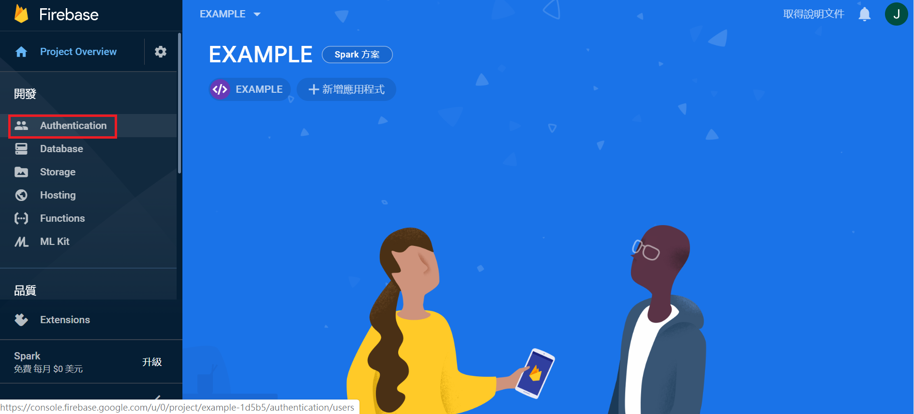
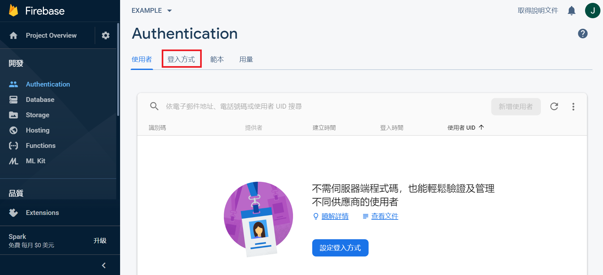
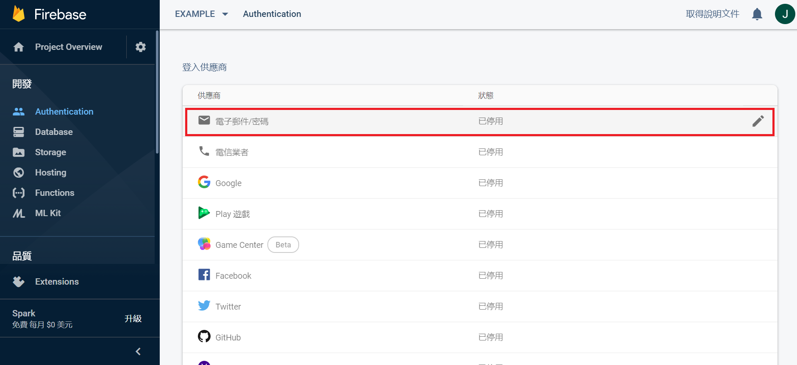
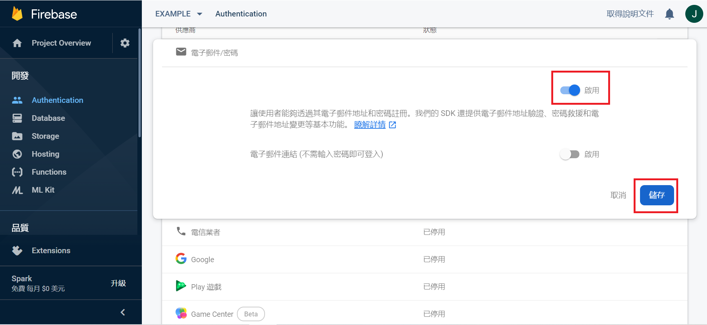

# 如何審核使用者登入的帳號密碼呢?

> code 編輯
* 打開 /src/app/login/login.page.ts，設定 Firebase 需要的東西
```js
      import { Component, OnInit } from '@angular/core';
      import { AngularFireAuth } from '@angular/fire/auth';
      import { auth } from 'firebase/app';
      import { UserService } from '../user.service';
      import { Router } from '@angular/router'

      @Component({
        selector: 'app-login',
        templateUrl: './login.page.html',
        styleUrls: ['./login.page.scss'],
      })
      
      export class LoginPage implements OnInit {
        username: string = ""
        password: string = ""
        constructor(
          public afAuth: AngularFireAuth, 
          public user: UserService, 
          public router: Router
        ) { }
      }
 ```     
      
* 在 app 下面新增 user.service.ts
```js 
	  import { AngularFireAuth } from '@angular/fire/auth'
	  import { first } from 'rxjs/operators'
	  import { auth } from 'firebase/app'
	  import { Injectable } from '@angular/core'

	  interface user {
		username: string,
		uid: string
	  }

	  @Injectable()
	  export class UserService {
		  private user: user
		  constructor(private afAuth: AngularFireAuth) {}
		  
		  setUser(user: user) {
			  this.user = user
		  }
		  
		  getUsername(): string {
			  return this.user.username
		  }

		  async isAuthenticated() {
			  if(this.user) return true

			  const user = await this.afAuth.authState.pipe(first()).toPromise()

			  if(user) {
				  this.setUser({
					  username: user.email.split('@')[0],
					  uid: user.uid
				  })
				  return true
			  }
			  return false
		  }

		  getUID(): string {
			  return this.user.uid
		  }
	  }
``` 
     
加了這個ts檔，之後在其他頁面都可以呼叫裡面的 function

使用前提 : 

1. 需要在最前面加入 import { UserService } from '../user.service'; 

2. 在 constructor 裡面加入 public user: UserService

 
* 把下面這個 function 寫進 login.page.ts 裡面
```js
      async login() {
            const { username, password } = this
            try {
                  const res = await this.afAuth.auth.signInWithEmailAndPassword(username + '@lazyq.com',password);
                  if(res.user) {
		            this.user.setUser({
			            username,
				      uid: res.user.uid
		            })
			      this.router.navigate(['/home'])
		      }
            }catch(err) {
                  console.dir(err)
                  if(err.code == "auth/user-not-found"){
                        console.log("user not found")
                  }
            }
      }
 ```
 注意!!! 在這裡，帳號需要使用 username + '@lazyq.com' 喔~~
 
 因為 Firebase 裡面，帳號都是用信箱去判斷的
 補充 : @lazyq.com 可以修改成自己想要的樣子，只要輸入是信箱格式就好了
 
> 啟動 Firebase 裡的登入方式
 接下來，只要跟著下面的步驟操作，就能順利登入囉
 
* 點擊《Authentication》
 
 
 
* 點擊《登入方式》
 
 
 
* 點擊《電子郵件/密碼》
 
 
 
* 點擊上方的《啟用》，再點擊《儲存》
 
 
\
參考資料: [FirebaseDocs](https://firebase.google.com/docs?hl=zh-tw)      
教學影片: [Firebase + ionic](https://www.youtube.com/watch?v=Q8zcieAWn3g&t=769s)
 
 
\
下一篇 : [機台資料連結](6_機台資料.md)
 
