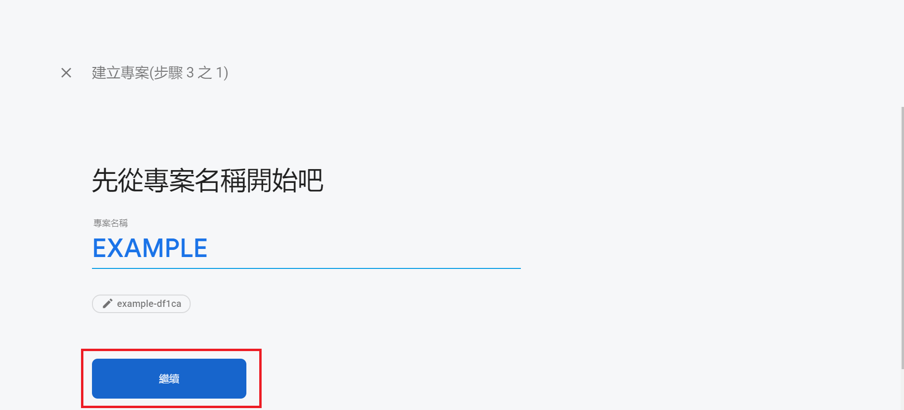
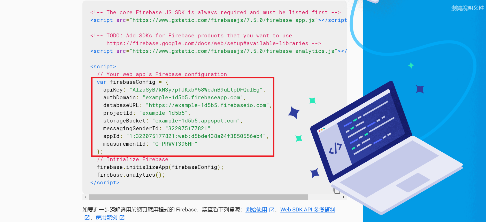

# ionic + Firebase
>在cmd中輸入以下指令
* install the firebase @angular/fire

      npm install firebase @angular/fire --save
      
      
> 開啟 Firebase

網站連結: [Firebase](https://firebase.google.com/)

開啟後會看到這樣 ↓ ↓ ↓

> 開啟 Firebase 專案
之後跟著下面的流程一起做~~~

這裡需要填寫完應用程式暱稱再點擊《註冊應用程式》唷

