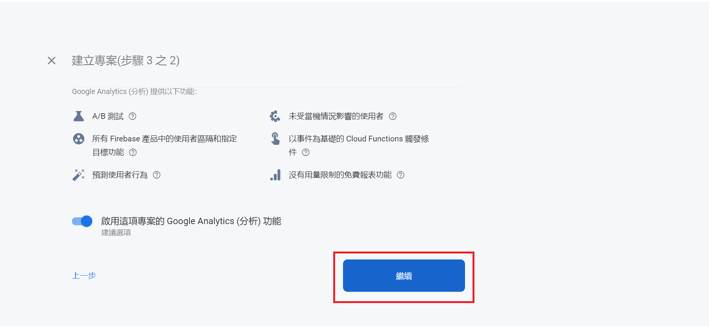
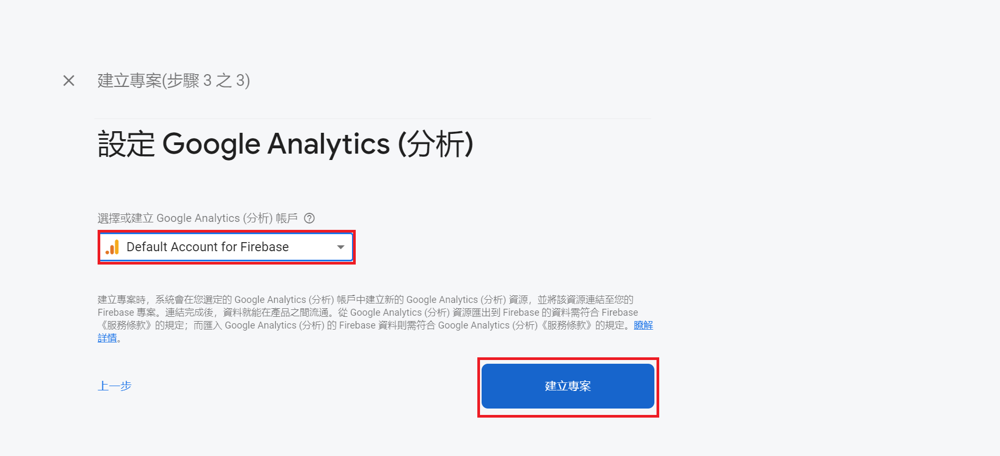
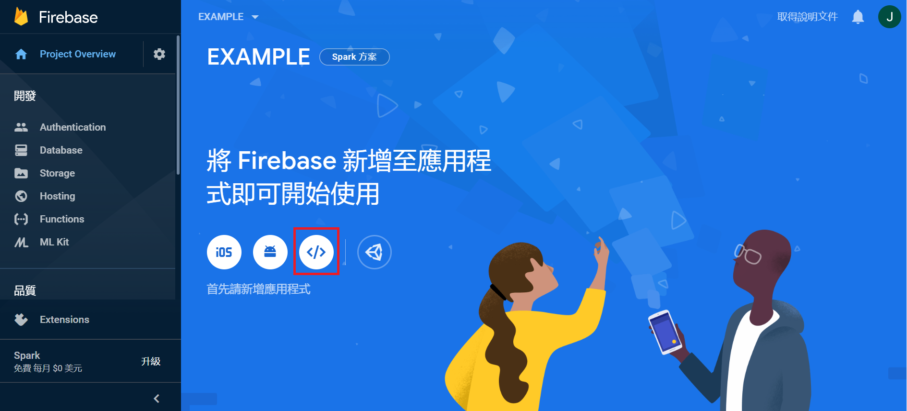

# ionic + Firebase
>在cmd中輸入以下指令
* install the firebase @angular/fire

      npm install firebase @angular/fire --save
      
  
  
> 開啟 Firebase

網站連結: [Firebase](https://firebase.google.com/)

開啟後會看到這樣 ↓ ↓ ↓

> 開啟 Firebase 專案
之後跟著下面的流程一起做~~~

點擊《新增專案》

填寫完專案名稱後，點擊《繼續》

點擊《繼續》

選取 Default Account for Firebase，點擊《建立專案》

點擊《網頁》

填寫應用程式暱稱，點擊《註冊應用程式》

把紅色框起來的部分先複製一份

