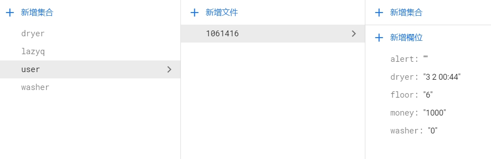

# 用戶的使用狀態

之前已經連接過了機台資訊，現在還有個用戶使用狀態又來連結 Firebase \
在這裡連結 Firebase 的方法跟之前提到的一樣，但是在這裡我們有不一樣的鏈結需求

>在 user 中，我們的資料代表意思是:\
alert是否要開啟提醒， 0 開啟、1 關閉\
dryer/washer [0]使用狀態， 0 無使用、 1 已預約、 2 排隊中、 3 使用中，[2]機台號，[4-7]可使用時間點\
floor 使用者喜好的樓層\
monry 使用者的餘額

**在使用者這裡會有4種狀態**
1. 無排隊無預約
2. 有預約
3. 有排隊
4. 正在使用

有預約就不能加入排隊，有排隊就不能預約，在使用時，排隊跟預約都不行\
洗衣時間預計為40分鐘，我們預估了50分鐘給一次機台使用，這時間包刮 : 放入衣物啟動洗衣、洗衣過程、結束洗衣拿取衣物\
如果在10分鐘內無啟動洗衣，我們將會判斷過號，取消本次使用\
\
**劃分好狀態後，我們開始決定在這些狀態下，需要運用到什麼資料 ?**

> 狀態一 : 無排隊無預約

在無排隊跟預約的情況下，我們只需要讀取 user 的使用資訊就可以解決這個狀態

> 狀態二 : 有預約

在有預約的情況下，washer/dryer 的資料型態是這樣的 **"1 6 08:25"** ，每個字代表的意思跟上方資料敘述依一樣\
我們只需要判斷一下是否到達預約的時間就可以了

> 狀態三 : 有排隊

排隊逛況的資料顯示跟預約的不太一樣，排隊的情況下，我們不會有時間的資料\
因為排隊的過程中，預計等到的時間會一狀況變動，所以，需等待的時間我們統一儲存在機台的 schedule 中\
由此可知，我們除了抓取 user 中的資料，還需要抓取 dryer/washer 的資料\
\
在這裡問題就來嘞，之前我們讀取資療的方式是這樣的 ↓ ↓ ↓
        
    var docRef = this.afstore.collection("user").doc(username);
    docRef.get().subscribe(function (doc) {
        //處理資料的地方
    })

乍看之下沒什麼問題，但是現在我們要在抓取 user 後，再抓取 washer/dryer \
如果我們直接這樣寫的話 ↓ ↓ ↓

    var docRef = this.afstore.collection("user").doc(username);
    docRef.get().subscribe(function (doc) {
        //處理資料的地方
        var docRef2 = this.afstore.collection("washer").doc(floor);
        docRef2.get().subscribe(function (doc2) {
            //處理資料的地方
        })
    })

系統會出現 error ，跟我們說 docRef2 的 collection 沒有定義\
那如果我們先抓完 user ，再把 user 使用機器的樓層丟給 washer/dryer 去抓取需要的 doc \
結果會發現 washer/dryer 無法抓到user丟的樓層資料，這是因為在讀取 Firebase 的時候，系統是非同步的\
所以在讀取 user 的同時，系統同時在讀取 washer/dryer ，結果就會導致上述狀況\
\
**在這裡，我們想到的解決方法是 :**\
先把要使用的 collection 都先抓取完，之後在連結需要抓的 doc 的話，這樣就可以執行了，很神奇吧 ~

    var docRef_D = this.afstore.collection("dryer")
    var docRef_W = this.afstore.collection("washer")
    var docRef_U = this.afstore.collection("user")
    docRef_U.doc(username).get().subscribe(function (doc) {
        //處理資料的地方
        docRef_W.doc(floor).get().subscribe(function (doc2) {
          //處理資料的地方
        })
    })

> 狀態四 : 正在使用

正在使用的情況下，跟預約的時候差不多，只是時間是表示結束的時間

