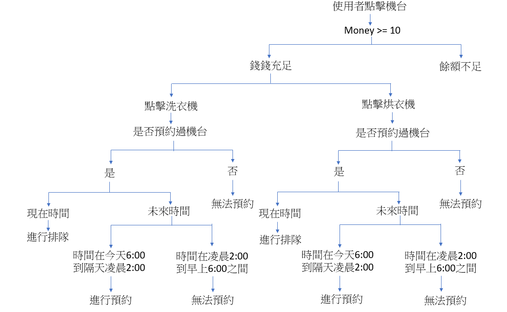

# 如何辨別要不要進行排隊預約呢?

下圖是構想圖:

> 機台預約

* 偵測有無碰撞 - 針對現在有在等待使用機台的人進行碰撞偵測

 如果發現 **其他使用者的開始時間** 和 **自己預約時間** 相差 **小於50** 的話則代表 **發生碰撞**

* 加入預約 

 按照時間順序，選擇適當位置，把使用者選擇的時間加入陣列中

> 機台排隊

* 偵測要排在哪裡 

前提 : 使用者的使用順序按照時間排好

**情況1** : 如果 **無人使用機台** ，使用者現在就可以使用機台

**情況2** : 如果排 **第一順位的使用者是預約用戶** ，則現在馬上就可以使用機台

**情況3** : 如果排 **第一順位的使用者是排隊用戶** ，則跑回圈偵測此機台哪一個時間**點可以最快使用機台
