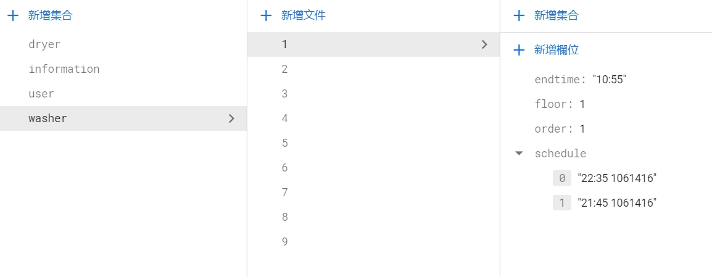

# 連結 Firebase 機台資料

處理好我們的 Firebase 後，我們開始來連結我們的資料到 APP 中 \
\
在這裡我們要來連結我們 APP 上顯示機台資訊的資料\
我們在 **Firebase** 中，資料處存的形式是這樣

機台資料的處理上，我們需要抓取到 **Firebase collection** 中，每一個 *doc* \
我們可以使用 for迴圈 來抓取我們所需要的資料

    for (let i = 1; i < 10; i++) {
        var b=""
        var docRef = this.afstore.collection("washer").doc(b + i);
        docRef.get().subscribe(function (doc) {
            //處理資料的地方
        })
    }

*在 javascript 中，結尾的 " ; " 可有可無* \
\
在 **docRef.get().subscribe(function (doc){}** 中，我們可以抓取到firebace的各個資料\
但是我們無法把裡面的資料 *push* 到位面的 array 中，那這樣我們該如何將我們的資料放到我們 APP 中呢 ? ? \
\
在這裡我們想到的解決方法是，我們在 **.html** 檔中，把我們想要放資料的位子的 <></> 中，設置一個 **id** \
並用 js 來抓取這個 ID ，來改變 <></> 中的東西

    document.getElementById("wf" + floor).innerHTML = ""

知道該怎麼寫後，我們開始來處理我們的資料吧 ~ \
我們想要顯示的資訊有很多，但是不能把介面搞得過於複雜，這樣對於使用者會造成許多的不便利

> **首先，我們先來思考一下我們想要給使用者得到的資訊有哪些 ? ? ?**
1. 一開始現在的時間點，每一台機台的使用狀態
2. 在使用者更動時間點後，我們需要顯示的機台使用狀態
3. 可預約的時間僅限今日 6.am ~ 隔日 2.am，
4. 每台機器在每次的預約時段中，只能被預約 **3** 次

>**機台的使用形況有三種:**
* 目前可以使用
* 正在被使用，排隊中
* 目前沒有被使用，但是未來50分鐘內機台已經被預約了 

這些情況都會需要用到我們的時間資訊，來計算某個時間點上，我們機台的使用情況\
在我們的資料中\ 
\

*endtime* 表示了我們機台目前的使用結束時間\
*floor* 表示機台所在位置\
*order* 表示已越約人數\
*schedule* 表示已排隊跟預約的資料

