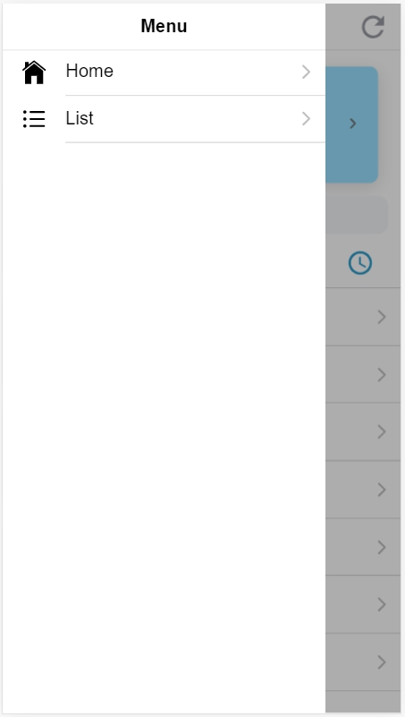

## Menu Page

在做完 Home Page 之後，我們要來開始編寫我們的 Menu ，在最初我們選擇模板的時候，我們是使用 *sidemenu* \
我們可以 **往右滑動** 或是 **點擊左上方圖示** 來開啟我們的 Menu \
一開始的 Menu 會長這樣 ↓ ↓ ↓ 

Ionic 已經幫我們設定好兩個連結\
一個是我們編譯過的 HomePage，另一個是 Ionic 幫你開好的新頁面 ListPage，但是我們這裡還不會用到這個頁面 \
\
那我們要更該這個 Menu 要從哪裡更動呢 ? ? ? \
他的code不在 HomePage ，也不在 ListPage ， 在 **src/app/app.component.html** 中

開啟他的 code 會看到這樣 ↓ ↓ ↓

這份 code 看起來很像一般的 HTML ，但是你會發現裡面多了很多不是 HTML 的東西 \
像是 : 
> ***ngFor="let p of appPages"** 

這是 Angular for 迴圈的寫法，他會把這個 **<> </>**  中間的 code 依照需求重複，讓五們不用重複打很多一樣的 code \
至於詳細他要怎麼用，我們未來用的的時候再來詳談它 : )

